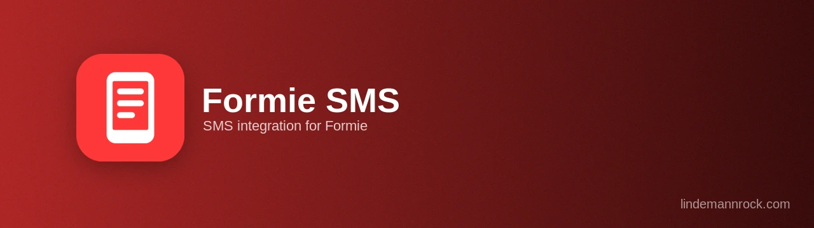

# Formie SMS Plugin for Craft CMS

[](https://packagist.org/packages/lindemannrock/craft-formie-sms)
[](https://craftcms.com/)
[](https://verbb.io/craft-plugins/formie)
[](https://github.com/LindemannRock/craft-sms-manager)
[](https://php.net/)
[](LICENSE)

A Craft CMS plugin that integrates Verbb's Formie with SMS Manager, enabling SMS notifications on form submission with multi-provider support and language filtering.

## License

This is a commercial plugin licensed under the [Craft License](https://craftcms.github.io/license/). It will be available on the [Craft Plugin Store](https://plugins.craftcms.com) soon. See [LICENSE.md](LICENSE.md) for details.

## ⚠️ Pre-Release

This plugin is in active development and not yet available on the Craft Plugin Store. Features and APIs may change before the initial public release.

## Features

- **SMS on submission** — send a text message every time a Formie form is submitted
- **Sender selection** — pick a sender ID per form, grouped by provider, or follow the SMS Manager default
- **Dynamic recipients** — text static numbers or pull them from form fields with variables
- **Personalized messages** — build the message from submission data using Formie variables
- **Language filtering** — only send for submissions from a specific site language
- **Multi-provider** — sends through any provider configured in SMS Manager
- **Logs & analytics** — every message is recorded in SMS Manager's SMS Logs and Analytics

## Requirements

- Craft CMS 5.0 or greater
- PHP 8.2 or greater
- [Formie](https://verbb.io/craft-plugins/formie) 3.0 or greater
- [SMS Manager](https://github.com/LindemannRock/craft-sms-manager) 5.0 or greater

## Installation

### Via Composer

```bash
composer require lindemannrock/craft-formie-sms
```

```bash
php craft plugin/install formie-sms
```

### Using DDEV

```bash
ddev composer require lindemannrock/craft-formie-sms
```

```bash
ddev craft plugin/install formie-sms
```

## Documentation

Full documentation is available in the [docs](docs/) folder.

## Support

- **Issues**: [GitHub Issues](https://github.com/LindemannRock/craft-formie-sms/issues)
- **Email**: [support@lindemannrock.com](mailto:support@lindemannrock.com)

## License

This plugin is licensed under the [Craft License](https://craftcms.github.io/license/). See [LICENSE.md](LICENSE.md) for details.

---

Developed by [LindemannRock](https://lindemannrock.com)

Built for use with [Formie](https://verbb.io/craft-plugins/formie) by Verbb and [SMS Manager](https://github.com/LindemannRock/craft-sms-manager)
